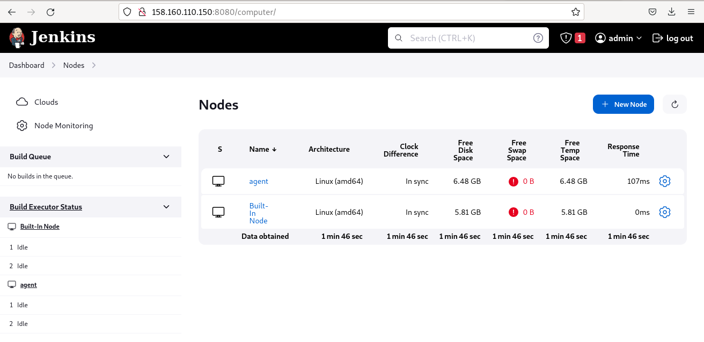

# Домашнее задание к занятию 10 «Jenkins»

## Подготовка к выполнению

1. Создать два VM: для jenkins-master и jenkins-agent.
2. Установить Jenkins при помощи playbook.
3. Запустить и проверить работоспособность.
4. Сделать первоначальную настройку.

## Основная часть

1. Сделать Freestyle Job, который будет запускать `molecule test` из любого вашего репозитория с ролью.  

2. Сделать Declarative Pipeline Job, который будет запускать `molecule test` из любого вашего репозитория с ролью.  

3. Перенести Declarative Pipeline в репозиторий в файл `Jenkinsfile`.  
[Jenkinsfile](https://github.com/juls-blekh/08-ansible-05-testing/blob/master/Jenkinsfile)
4. Создать Multibranch Pipeline на запуск `Jenkinsfile` из репозитория.  

5. Создать Scripted Pipeline, наполнить его скриптом из [pipeline](./pipeline).
6. Внести необходимые изменения, чтобы Pipeline запускал `ansible-playbook` без флагов `--check --diff`, если не установлен параметр при запуске джобы (prod_run = True). По умолчанию параметр имеет значение False и запускает прогон с флагами `--check --diff`.  
    
secret_check=true

secret_check=false

8. Проверить работоспособность, исправить ошибки, исправленный Pipeline вложить в репозиторий в файл `ScriptedJenkinsfile`.
9. Отправить ссылку на репозиторий с ролью и Declarative Pipeline и Scripted Pipeline.   
[Repository](https://github.com/juls-blekh/08-ansible-05-testing)   
[Jenkinsfile](https://github.com/juls-blekh/08-ansible-05-testing/blob/master/Jenkinsfile)   
[Scripted Pipeline](https://github.com/juls-blekh/09-ci-04-jenkins/blob/master/Jenkinsfile_scripted)   

---

### Как оформить решение задания

Выполненное домашнее задание пришлите в виде ссылки на .md-файл в вашем репозитории.

---
